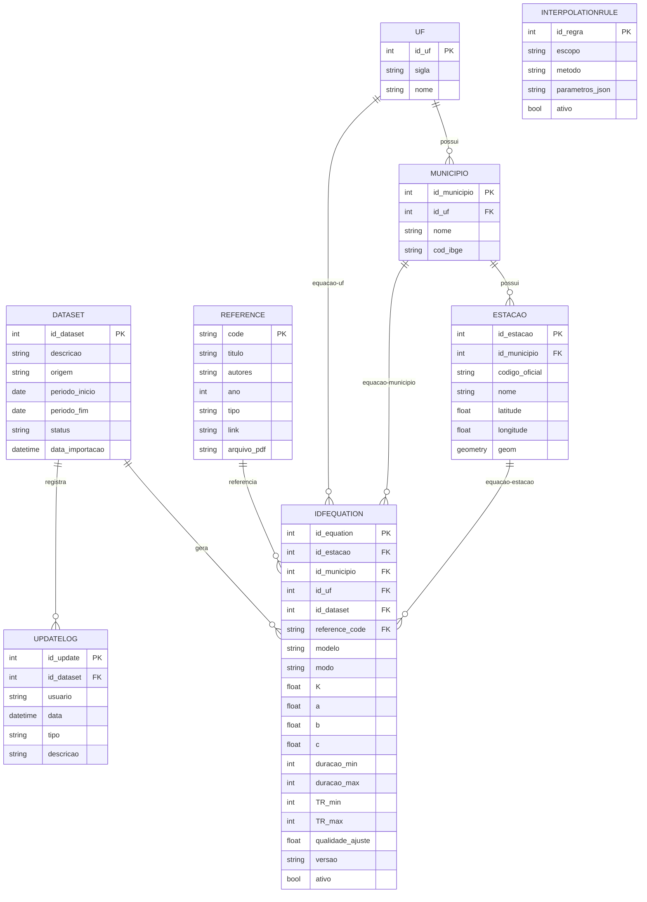
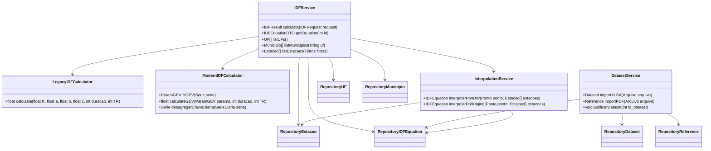
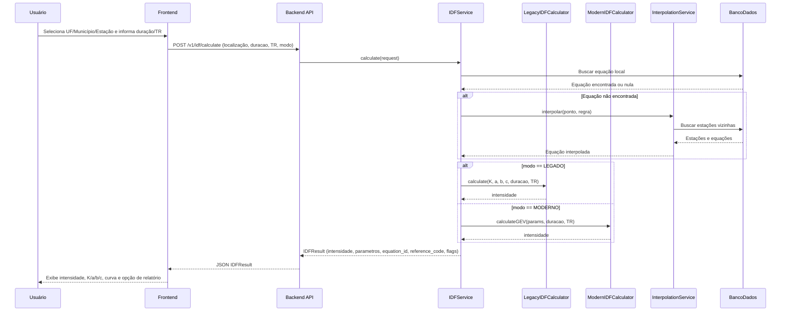
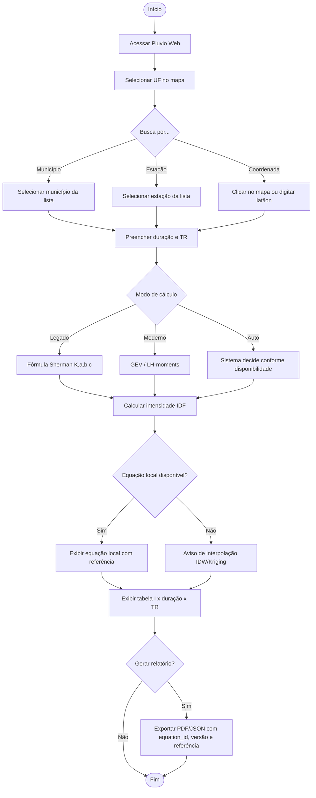
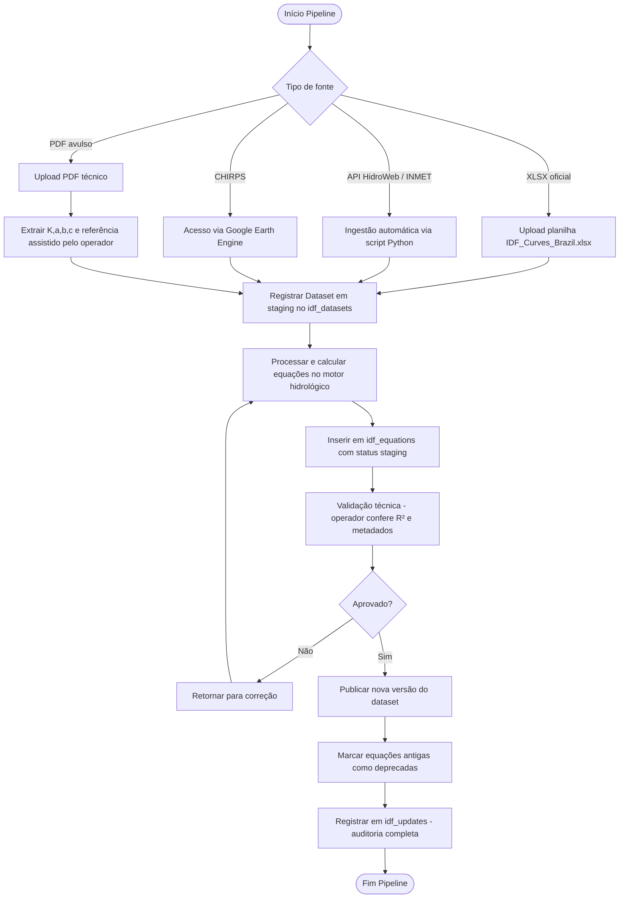
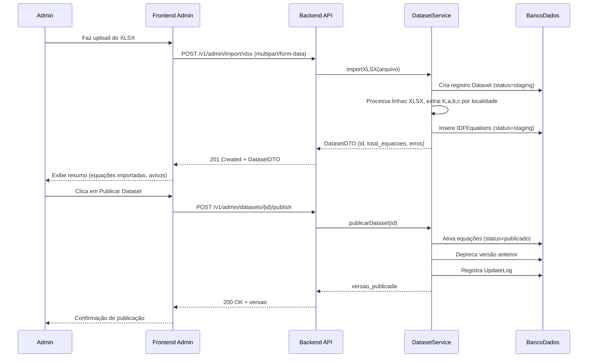
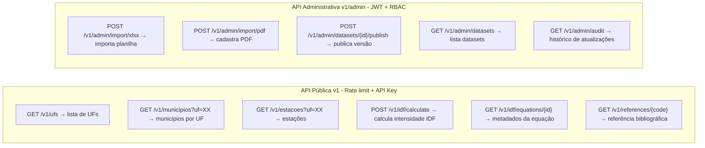
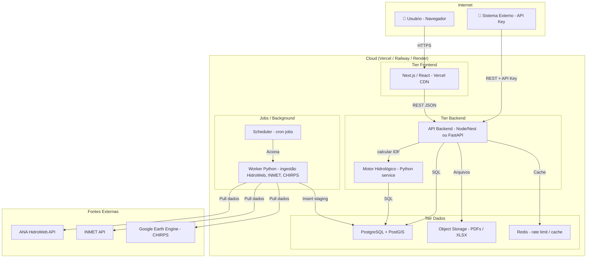
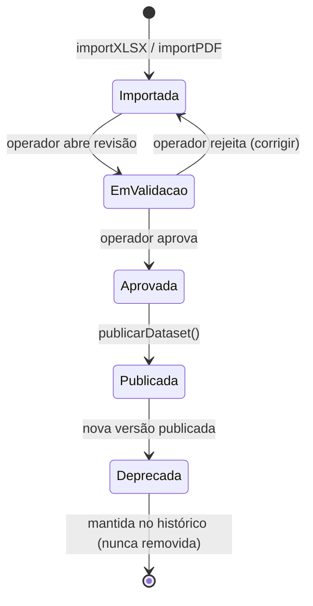

# Arquitetura Pluvio Web 3.x

Plataforma web para cálculo de curvas IDF, mantendo compatibilidade com o Plúvio 2.1 (modo legado) e suportando métodos modernos (GEV, desagregação, interpolação espacial).

---

## 1. Estrutura de Pastas

### 1.1 Frontend (React/Next ou Vite)

```text
frontend/
  node_modules/
  public/
  src/
    assets/
    components/
      layout/
      ui/
      map/
      forms/
      reports/
    data/
    hooks/
    pages/
      Admin/
      Auth/
      Home/
      IDF/
      User/
    redux/
    utils/
    App.jsx
    main.jsx
    index.css
  package.json
  vite.config.js
  vercel.json
  .eslintrc.cjs
  .gitignore
```

### 1.2 Backend (Node + Nest/Fastify ou Express)

```text
server/
  configs/
  controllers/
    idf.controller.js
    admin.controller.js
    auth.controller.js
  helpers/
  middlewares/
    auth.middleware.js
    ratelimit.middleware.js
  models/
    idf_equation.model.js
    dataset.model.js
    estacao.model.js
    municipio.model.js
    reference.model.js
    update_log.model.js
  routes/
    v1.routes.js
    admin.routes.js
  services/
    idf.service.js
    dataset.service.js
    interpolation.service.js
    legacy_calculator.py
    modern_calculator.py
  validators/
    idf.validator.js
  tests/
  .env
  package.json
  server.js
  vercel.json
  .gitignore
```

---

## 2. Diagrama de Casos de Uso (Mermaid)

```mermaid
flowchart TD
  subgraph Atores
    U["👤 Usuário"]
    A["🔧 Administrador"]
    S["🔌 Sistema Externo"]
  end

  subgraph Casos_de_Uso_Usuario["Casos de Uso - Usuário"]
    UC01["UC01 - Selecionar UF/Município/Estação"]
    UC02["UC02 - Informar duração e TR"]
    UC03["UC03 - Solicitar cálculo IDF"]
    UC04["UC04 - Visualizar parâmetros e curva"]
    UC05["UC05 - Gerar relatório técnico PDF/JSON"]
  end

  subgraph Casos_de_Uso_Admin["Casos de Uso - Administrador"]
    UC10["UC10 - Fazer login administrativo"]
    UC11["UC11 - Importar planilha XLSX"]
    UC12["UC12 - Cadastrar relatório PDF"]
    UC13["UC13 - Validar e publicar versão"]
    UC14["UC14 - Consultar histórico e auditoria"]
  end

  subgraph Casos_de_Uso_Externo["Casos de Uso - Sistema Externo"]
    UC20["UC20 - Listar UFs, municípios e estações"]
    UC21["UC21 - Chamar /idf/calculate"]
    UC22["UC22 - Consultar equações e referências"]
  end

  U --> UC01
  U --> UC02
  U --> UC03
  U --> UC04
  U --> UC05

  A --> UC10
  A --> UC11
  A --> UC12
  A --> UC13
  A --> UC14

  S --> UC20
  S --> UC21
  S --> UC22
```



---

## 3. Modelo ER (Mermaid)



---

## 4. Diagrama de Classes / Componentes UML (Mermaid)



---

## 5. Diagrama de Sequência – Cálculo IDF (Mermaid)



---

## 6. Diagrama de Atividades – Fluxo do Usuário (Mermaid)



---

## 7. Diagrama de Atividades – Pipeline de Atualização de Dados (Mermaid)



---

## 8. Diagrama de Sequência – Importação XLSX pelo Admin (Mermaid)



---

## 9. Contrato OpenAPI – Endpoints Principais (Mermaid)



---

## 10. Payload de Resposta – POST /v1/idf/calculate

```json
{
  "input": {
    "latitude": -20.7546,
    "longitude": -42.8825,
    "duracao_min": 60,
    "TR_anos": 25,
    "modo": "LEGADO"
  },
  "resultado": {
    "intensidade_mm_h": 72.43,
    "unidade": "mm/h"
  },
  "equacao": {
    "equation_id": 1042,
    "equation_version": "v2025.03",
    "modelo": "SHERMAN",
    "modo": "LEGADO",
    "K": 1285.7,
    "a": 0.185,
    "b": 18.0,
    "c": 0.79,
    "duracao_min": 10,
    "duracao_max": 1440,
    "TR_min": 2,
    "TR_max": 100
  },
  "referencia": {
    "reference_code": "FIORIO_2012",
    "titulo": "Plúvio 2.1 - GPRH/UFV",
    "ano": 2012,
    "link": "http://www.gprh.ufv.br"
  },
  "localidade": {
    "uf": "MG",
    "municipio": "Viçosa",
    "estacao": "02042007",
    "tipo_equacao": "LOCAL"
  },
  "flags": {
    "interpolada": false,
    "extrapolada": false,
    "aviso": null,
    "dataset_id": 7
  }
}
```

---

## 11. DDL SQL – Banco de Dados (PostgreSQL + PostGIS)

```sql
-- Habilitar extensão geográfica
CREATE EXTENSION IF NOT EXISTS postgis;

-- UF
CREATE TABLE uf (
  id_uf     SERIAL PRIMARY KEY,
  sigla     CHAR(2) NOT NULL UNIQUE,
  nome      VARCHAR(50) NOT NULL
);

-- Município
CREATE TABLE municipio (
  id_municipio  SERIAL PRIMARY KEY,
  id_uf         INT NOT NULL REFERENCES uf(id_uf),
  nome          VARCHAR(100) NOT NULL,
  cod_ibge      CHAR(7) UNIQUE
);

-- Estação pluviométrica
CREATE TABLE estacao (
  id_estacao      SERIAL PRIMARY KEY,
  id_municipio    INT NOT NULL REFERENCES municipio(id_municipio),
  codigo_oficial  VARCHAR(20) UNIQUE,
  nome            VARCHAR(100),
  latitude        DOUBLE PRECISION NOT NULL,
  longitude       DOUBLE PRECISION NOT NULL,
  geom            GEOMETRY(Point, 4326),
  altitude_m      DOUBLE PRECISION,
  fonte_geometria VARCHAR(50)
);
CREATE INDEX idx_estacao_geom ON estacao USING GIST(geom);

-- Referência bibliográfica
CREATE TABLE reference (
  code        VARCHAR(50) PRIMARY KEY,
  titulo      TEXT NOT NULL,
  autores     TEXT,
  ano         INT,
  tipo        VARCHAR(30),
  link        TEXT,
  arquivo_pdf TEXT
);

-- Dataset de origem
CREATE TABLE dataset (
  id_dataset      SERIAL PRIMARY KEY,
  descricao       TEXT,
  origem          VARCHAR(50) NOT NULL,
  periodo_inicio  DATE,
  periodo_fim     DATE,
  status          VARCHAR(20) NOT NULL DEFAULT 'staging',
  data_importacao TIMESTAMP NOT NULL DEFAULT NOW()
);

-- Equações IDF
CREATE TABLE idf_equation (
  id_equation     SERIAL PRIMARY KEY,
  id_estacao      INT REFERENCES estacao(id_estacao),
  id_municipio    INT REFERENCES municipio(id_municipio),
  id_uf           INT REFERENCES uf(id_uf),
  id_dataset      INT NOT NULL REFERENCES dataset(id_dataset),
  reference_code  VARCHAR(50) REFERENCES reference(code),
  modelo          VARCHAR(30) NOT NULL DEFAULT 'SHERMAN',
  modo            VARCHAR(20) NOT NULL DEFAULT 'LEGADO',
  K               DOUBLE PRECISION,
  a               DOUBLE PRECISION,
  b               DOUBLE PRECISION,
  c               DOUBLE PRECISION,
  duracao_min     INT,
  duracao_max     INT,
  TR_min          INT,
  TR_max          INT,
  qualidade_ajuste DOUBLE PRECISION,
  versao          VARCHAR(20),
  ativo           BOOLEAN NOT NULL DEFAULT TRUE,
  criado_em       TIMESTAMP NOT NULL DEFAULT NOW()
);
CREATE INDEX idx_idf_equation_uf ON idf_equation(id_uf);
CREATE INDEX idx_idf_equation_municipio ON idf_equation(id_municipio);
CREATE INDEX idx_idf_equation_estacao ON idf_equation(id_estacao);
CREATE INDEX idx_idf_equation_ativo ON idf_equation(ativo);

-- Regras de interpolação
CREATE TABLE interpolation_rule (
  id_regra       SERIAL PRIMARY KEY,
  escopo         VARCHAR(50),
  metodo         VARCHAR(20) NOT NULL DEFAULT 'IDW',
  parametros_json JSONB,
  ativo          BOOLEAN NOT NULL DEFAULT TRUE
);

-- Log de atualizações
CREATE TABLE update_log (
  id_update   SERIAL PRIMARY KEY,
  id_dataset  INT NOT NULL REFERENCES dataset(id_dataset),
  usuario     VARCHAR(100),
  data        TIMESTAMP NOT NULL DEFAULT NOW(),
  tipo        VARCHAR(30),
  descricao   TEXT
);
```

---

## 12. Diagrama de Deploy / Infraestrutura (Mermaid)



---

## 13. Diagrama de Estado – Ciclo de Vida de uma Equação IDF (Mermaid)



---

## 14. Motor de Cálculo – Exemplos de Código Python

### 14.1 Calculadora Legada (Sherman)

```python
# services/legacy_calculator.py

def calcular_intensidade_sherman(K: float, a: float, b: float, c: float,
                                  duracao_min: int, TR_anos: int) -> float:
    """
    Fórmula IDF tipo Sherman (compatível com Plúvio 2.1):
    I = K * TR^a / (t + b)^c
    Retorna intensidade em mm/h.
    """
    return K * (TR_anos ** a) / ((duracao_min + b) ** c)
```

### 14.2 Calculadora Moderna (GEV)

```python
# services/modern_calculator.py

import numpy as np
from scipy.stats import genextreme

def ajustar_gev(serie_maximas: list[float]) -> dict:
    """
    Ajusta distribuição GEV à série de máximas anuais.
    Retorna parâmetros: shape (xi), loc (mu), scale (sigma).
    """
    xi, mu, sigma = genextreme.fit(serie_maximas)
    return {"xi": xi, "mu": mu, "sigma": sigma}

def calcular_quantil_gev(params: dict, TR_anos: int) -> float:
    """
    Retorna quantil de precipitação para dado TR (mm/h).
    """
    prob_nao_excedencia = 1 - (1 / TR_anos)
    return genextreme.ppf(prob_nao_excedencia,
                          c=params["xi"],
                          loc=params["mu"],
                          scale=params["sigma"])

def desagregar_chuva_diaria(Pd_mm: float, duracao_min: int,
                              metodo: str = "CETESB") -> float:
    """
    Desagregação de chuva diária para subdiária.
    Coeficientes padrão CETESB/Marques (método clássico brasileiro).
    Retorna intensidade em mm/h.
    """
    coeficientes = {
        1440: 1.00, 720: 0.84, 600: 0.81, 480: 0.78,
        360:  0.74, 240: 0.69, 120: 0.61,  60: 0.52,
         30:  0.43,  20: 0.39,  15: 0.36,  10: 0.32,
          5:  0.27
    }
    duracao_valida = min(coeficientes.keys(),
                        key=lambda x: abs(x - duracao_min))
    Pt = Pd_mm * coeficientes[duracao_valida]
    duracao_h = duracao_valida / 60
    return Pt / duracao_h
```

### 14.3 Interpolação Espacial (IDW)

```python
# services/interpolation.py

import numpy as np

def interpolar_idw(ponto_alvo: tuple[float, float],
                   estacoes: list[dict],
                   potencia: int = 5) -> dict:
    """
    Interpolação IDW (Inverse Distance Weighting) para parâmetros K,a,b,c.
    ponto_alvo: (lat, lon)
    estacoes: lista de dicts com lat, lon, K, a, b, c
    Retorna dict com K, a, b, c interpolados.
    """
    lat0, lon0 = ponto_alvo
    pesos = []
    for est in estacoes:
        dist = np.sqrt((est["lat"] - lat0)**2 + (est["lon"] - lon0)**2)
        if dist == 0:
            return {"K": est["K"], "a": est["a"],
                    "b": est["b"], "c": est["c"]}
        pesos.append(1 / dist**potencia)

    total = sum(pesos)
    K = sum(p * e["K"] for p, e in zip(pesos, estacoes)) / total
    a = sum(p * e["a"] for p, e in zip(pesos, estacoes)) / total
    b = sum(p * e["b"] for p, e in zip(pesos, estacoes)) / total
    c = sum(p * e["c"] for p, e in zip(pesos, estacoes)) / total
    return {"K": K, "a": a, "b": b, "c": c}
```

---

## 15. Compatibilidade com Plúvio 2.1 – Checklist

- [ ] Fluxo UF → município/estação idêntico ao 2.1
- [ ] Banco inicial carregado com K, a, b, c originais do 2.1
- [ ] Modo LEGADO como padrão nas regiões sem equação moderna validada
- [ ] Aviso de interpolação/extrapolação explícito (como no desktop)
- [ ] Relatório com estrutura narrativa compatível com o 2.1
- [ ] Cobertura inicial: MG, SP, PR, RJ, ES, BA, TO + localidades avulsas
- [ ] equation_version + reference_code em todo relatório gerado

---

## 16. Matriz de Módulos Principais

| Módulo | Stack | Responsabilidade |
|---|---|---|
| Frontend Web | Next.js + React + Leaflet | Mapa, seleção, formulário IDF, relatório |
| API Backend | Node/NestJS ou FastAPI | Endpoints públicos + admin, autenticação |
| Motor Hidrológico | Python + NumPy/SciPy | Sherman, GEV, desagregação, IDW/Kriging |
| Worker de Ingestão | Python + Pandas | HidroWeb, INMET, CHIRPS, XLSX, PDF |
| Banco de Dados | PostgreSQL + PostGIS | Equações, estações, referências, versões |
| Cache | Redis | Rate limit, cache de consultas frequentes |
| Storage | S3 / Object Storage | PDFs técnicos, planilhas importadas |
| Scheduler | Cron / Celery Beat | Trigger de atualização periódica de dados |

---

*Pluvio Web 3.x – Arquitetura completa v1.0*
*André Phillipe dos Santos Batista – 2026*
