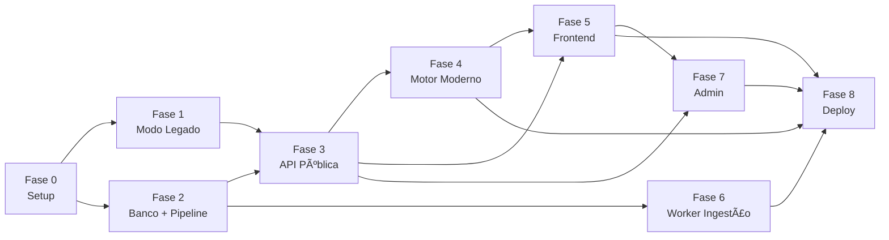

# Pluvio Web 3.x — Plano Geral de Desenvolvimento

> **Autor:** André Phillipe dos Santos Batista  
> **Versão:** 1.0 — 2026  
> **Objetivo:** Reescrever o Plúvio 2.1 como plataforma web pública com motor IDF atualizado, API REST, banco versionado e interface geográfica interativa.

---

## Visão Geral das Etapas

| Fase | Nome                                 | Entregável principal                  | Status |
| ---- | ------------------------------------ | ------------------------------------- | ------ |
| 0    | Setup e infraestrutura base          | Ambiente rodando localmente           | [~]    |
| 1    | Paridade funcional com Pluvio 2.1    | Modo legado funcionando na web        | [~]    |
| 2    | Banco de dados e importacao de dados | Equacoes migradas + pipeline XLSX     | [~]    |
| 3    | API publica v1                       | Endpoints documentados e testados     | [~]    |
| 4    | Motor moderno                        | GEV, desagregação, interpolação       | [ ]    |
| 5    | Frontend web completo                | Interface com mapa e relatório        | [ ]    |
| 6    | Worker de ingestão                   | HidroWeb, INMET, CHIRPS automatizados | [ ]    |
| 7    | Admin e governança                   | Painel de validação e publicação      | [ ]    |
| 8    | Testes, docs e deploy                | Produção, OpenAPI, documentação       | [ ]    |

---

### Legenda de Status
- [ ] nao iniciado
- [~] em andamento
- [x] concluido

### Atualizacao de Status (20/02/2026)
- Fase 0: estrutura base criada para frontend (Next.js) e backend (NestJS), com /health no backend.
- Fase 1: endpoints legados principais ativos (/v1/ufs, /v1/municipios, /v1/estacoes, /v1/idf/calculate).
- Fase 2: leitura de equacoes via IDF_Curves_Brazil.xlsx implementada (abas Standard, Disaggregation e Reference list).
- Fase 3: endpoint GET /v1/idf/equations/:id e modulo de referencias (GET /v1/references, GET /v1/references/:code).
- Pendencia atual: validacao runtime dos endpoints e inicio da camada de dataset versionado.

## FASE 0 — Setup e Infraestrutura Base

### Objetivo
Ter o ambiente de desenvolvimento 100% funcional antes de escrever qualquer lógica de negócio.

### Checklist

#### Repositório e estrutura
- [ ] Criar repositório Git (mono-repo ou multi-repo)
- [ ] Criar estrutura de pastas: `/server`, `/frontend`, `/motor`, `/docs`, `/credentials`
- [ ] Adicionar `.gitignore` global (Node, Python, .env, storage)
- [ ] Criar `README.md` raiz com visão geral do projeto

#### Docker e banco
- [ ] Copiar `docker-compose.yml` e `.env.example` para a raiz
- [ ] Criar `.env` local com as variáveis preenchidas
- [ ] Subir `docker compose up -d` e validar containers: db, redis
- [ ] Confirmar PostGIS ativo: `SELECT PostGIS_Version();`
- [ ] Testar conexão com pgAdmin ou DBeaver

#### Backend base
- [ ] Inicializar projeto NestJS: `nest new server`
- [ ] Instalar dependências do `package.backend.json`
- [ ] Configurar Prisma: `prisma init` + colar `schema.prisma`
- [ ] Rodar `prisma migrate dev --name init`
- [ ] Rodar `prisma generate`
- [ ] Confirmar tabelas criadas no banco
- [ ] Criar endpoint `/health` retornando `{ status: "ok" }`

#### Motor Python base
- [ ] Criar pasta `/motor` com `main.py`
- [ ] Instalar dependências do `requirements.motor.txt`
- [ ] Criar endpoint `/health` FastAPI retornando `{ status: "ok" }`
- [ ] Dockerizar e confirmar comunicação API ↔ Motor

#### Frontend base
- [ ] Inicializar Next.js: `npx create-next-app@latest frontend`
- [ ] Instalar dependências do `package.frontend.json`
- [ ] Configurar Tailwind CSS
- [ ] Criar página inicial com título "Pluvio Web 3.x"
- [ ] Confirmar comunicação com a API via `NEXT_PUBLIC_API_URL`

---

## FASE 1 — Paridade Funcional com Plúvio 2.1 (Modo Legado)

### Objetivo
Replicar exatamente o comportamento do Plúvio 2.1 desktop na web, sem adicionar nenhuma funcionalidade nova ainda.

### Checklist

#### Dados legados
- [ ] Carregar equações originais do Plúvio 2.1 (K, a, b, c) via seed SQL
- [ ] Cobrir estados originais: MG, SP, PR, RJ, ES, BA, TO
- [ ] Associar cada equação a `reference_code = "FIORIO_2012"` e `modo = LEGADO`
- [ ] Validar contagem de localidades carregadas vs. original

#### Motor legado
- [ ] Implementar `legacy_calculator.py`: fórmula Sherman `I = K * TR^a / (t + b)^c`
- [ ] Validar resultado para localidade conhecida (ex.: Viçosa-MG, t=60, TR=25)
- [ ] Implementar seleção de equação: por estação → município → UF
- [ ] Implementar aviso de interpolação quando equação local não existe

#### API legado
- [ ] `GET /v1/ufs` — lista de UFs com equações disponíveis
- [ ] `GET /v1/municipios?uf=MG` — municípios/estações por UF
- [ ] `POST /v1/idf/calculate` — corpo mínimo: uf, municipio, duracao, TR, modo=LEGADO
- [ ] Validar retorno: intensidade, K, a, b, c, tipo_equacao, reference_code

#### Frontend legado
- [ ] Tela de seleção de UF (lista ou mapa simples)
- [ ] Tela de seleção de município/estação
- [ ] Formulário de cálculo: duração (min) e TR (anos)
- [ ] Exibição de resultado: intensidade, K, a, b, c
- [ ] Exibir aviso quando usar interpolação

---

## FASE 2 — Banco de Dados e Pipeline de Importação

### Objetivo
Estruturar o banco versionado e criar o pipeline que importa planilhas XLSX e PDFs técnicos.

### Checklist

#### Banco versionado
- [ ] Confirmar tabelas: `idf_equation`, `dataset`, `reference`, `update_log`
- [ ] Implementar enum `DatasetStatus`: staging → publicado → deprecado
- [ ] Implementar lógica de versionamento: publicar depreca versão anterior
- [ ] Criar seed de referências bibliográficas base (FIORIO_2012, NBR10844, etc.)

#### Importação XLSX
- [ ] Implementar `DatasetService.importXLSX(arquivo)`
- [ ] Parsear colunas: UF, município, estação, K, a, b, c, duração, TR, referência
- [ ] Tratar erros de linha (logar e continuar)
- [ ] Inserir em `idf_equation` com `status = staging`
- [ ] Retornar resumo: total importado, erros, dataset_id

#### Importação PDF
- [ ] Implementar `DatasetService.importPDF(arquivo)`
- [ ] Salvar PDF no storage e criar registro em `reference`
- [ ] Tela admin de cadastro manual assistido: operador preenche K, a, b, c + fonte
- [ ] Associar equação ao PDF como referência

#### Auditoria
- [ ] Registrar cada importação em `update_log`
- [ ] Registrar publicação em `update_log` com usuário e timestamp
- [ ] Endpoint `GET /v1/admin/audit` retorna histórico paginado

---

## FASE 3 — API Pública v1

### Objetivo
Publicar a API REST documentada, com rate limit, API key e swagger disponível.

### Checklist

#### Endpoints públicos
- [ ] `GET /v1/ufs`
- [ ] `GET /v1/municipios?uf=XX`
- [ ] `GET /v1/estacoes?uf=XX&municipio=YYY`
- [ ] `POST /v1/idf/calculate` (modo AUTO, LEGADO ou MODERNO)
- [ ] `GET /v1/idf/equations/{id}`
- [ ] `GET /v1/references/{code}`

#### Segurança e controle
- [ ] Implementar rate limiting via Redis + `@nestjs/throttler`
- [ ] Implementar API Key para uso externo (header `x-api-key`)
- [ ] Implementar JWT + RBAC para rotas `/admin`
- [ ] Criar papéis: ADMIN, VALIDADOR, READONLY

#### Documentação
- [ ] Configurar Swagger (`@nestjs/swagger`) em `/api/docs`
- [ ] Documentar todos os DTOs de entrada e saída
- [ ] Documentar exemplos de payload (incluindo resposta com flags de interpolação)
- [ ] Exportar `openapi.json` para uso em clientes externos

#### Testes da API
- [ ] Testes unitários do `IDFService`
- [ ] Testes e2e dos endpoints principais com Supertest
- [ ] Validar retorno de `equation_id`, `equation_version`, `reference_code` em todos os cálculos

---

## FASE 4 — Motor Moderno (GEV, Desagregação, Interpolação)

### Objetivo
Ativar os métodos hidrológicos modernos no motor Python.

### Checklist

#### GEV e LH-Moments
- [ ] Implementar `ajustar_gev(serie)` com SciPy `genextreme`
- [ ] Implementar `calcular_quantil_gev(params, TR)` 
- [ ] Implementar ajuste por LH-Moments como alternativa
- [ ] Validar resultados contra séries de referência da literatura
- [ ] Comparar GEV vs. Sherman para localidades com ambas as equações

#### Desagregação de chuva diária
- [ ] Implementar método CETESB/Marques (coeficientes clássicos brasileiros)
- [ ] Implementar método Kimball
- [ ] Implementar método Knoessen
- [ ] Validar para diferentes durações: 5, 10, 15, 30, 60, 120, 240 min

#### Interpolação espacial
- [ ] Implementar IDW (potência 5, configurável por regra)
- [ ] Implementar Kriging Ordinário via PyKrige ou PySAL
- [ ] Buscar N estações vizinhas dentro de raio configurável por UF
- [ ] Retornar flag `interpolada: true` + distância média no resultado
- [ ] Registrar qual regra de interpolação foi usada no payload

#### Integração API ↔ Motor
- [ ] API NestJS chama Motor Python via HTTP interno (ou fila)
- [ ] Motor recebe request com série ou parâmetros e retorna resultado
- [ ] Tratar timeout e fallback para modo legado se motor moderno falhar

---

## FASE 5 — Frontend Web Completo

### Objetivo
Interface profissional com mapa interativo, seleção geográfica, cálculo e relatório exportável.

### Checklist

#### Mapa e seleção geográfica
- [ ] Integrar React-Leaflet com camada do Brasil por UF
- [ ] Ao clicar em UF → listar municípios/estações
- [ ] Campo de busca por nome de município
- [ ] Campo de entrada de lat/lon + marcador no mapa
- [ ] Destacar estação selecionada no mapa

#### Formulário e cálculo
- [ ] Campos: duração (min), TR (anos), modo (LEGADO/MODERNO/AUTO)
- [ ] Validação com Zod + React Hook Form
- [ ] Exibir K, a, b, c da equação selecionada (modo legado)
- [ ] Exibir tipo de equação: LOCAL / INTERPOLADA / EXTRAPOLADA
- [ ] Exibir aviso com distância à estação mais próxima (quando interpolado)

#### Resultados e curvas
- [ ] Tabela de intensidades: I (mm/h) × duração × TR
- [ ] Gráfico de curvas IDF com Recharts
- [ ] Alternar entre mm/h e mm/min
- [ ] Comparar Modo Legado vs. Moderno no mesmo gráfico (quando disponível)

#### Relatório exportável
- [ ] Botão "Exportar PDF" com jsPDF
- [ ] Relatório contém: localidade, equação, parâmetros, tabela IDF, referência, versão
- [ ] Botão "Exportar JSON" com payload completo do cálculo

#### UX e responsividade
- [ ] Layout responsivo (mobile e desktop)
- [ ] Loading states em todas as chamadas à API
- [ ] Mensagens de erro amigáveis
- [ ] Favicon e identidade visual mínima

---

## FASE 6 — Worker de Ingestão de Dados

### Objetivo
Automatizar a ingestão de dados de HidroWeb (ANA), INMET e CHIRPS.

### Checklist

#### HidroWeb ANA
- [ ] Implementar cliente Python para API HidroWeb
- [ ] Buscar lista de estações pluviométricas por UF
- [ ] Baixar séries históricas de precipitação máxima anual
- [ ] Salvar séries brutas em storage e registrar em `dataset`
- [ ] Acionar motor para calcular equações IDF com séries baixadas

#### INMET
- [ ] Implementar cliente para API INMET
- [ ] Baixar dados de estações automáticas e convencionais
- [ ] Integrar ao pipeline de ingestão existente

#### CHIRPS (Google Earth Engine)
- [ ] Configurar autenticação GEE com service account
- [ ] Script Python para extrair séries CHIRPS por ponto (lat/lon)
- [ ] Validar correlação com dados de estação (r ≥ 0,83)
- [ ] Usar CHIRPS para regiões sem cobertura de estação convencional

#### Scheduler
- [ ] Configurar Celery Beat para agendamento de tarefas
- [ ] Tarefa semanal: verificar novas séries disponíveis no HidroWeb
- [ ] Tarefa mensal: atualizar CHIRPS para regiões sem estação
- [ ] Log de execução em `update_log`

---

## FASE 7 — Painel Admin e Governança

### Objetivo
Interface administrativa para importar, validar e publicar equações com rastreabilidade total.

### Checklist

#### Autenticação admin
- [ ] Tela de login com JWT
- [ ] Proteção de rotas admin no frontend
- [ ] Gerenciamento de usuários (ADMIN pode criar VALIDADOR)

#### Painel de datasets
- [ ] Listar datasets em staging com resumo (total equações, origem, data)
- [ ] Visualizar equações de um dataset: tabela com K, a, b, c, localidade
- [ ] Gráfico de curva IDF pré-visualizado por equação
- [ ] Aprovar ou rejeitar equação individual
- [ ] Publicar dataset completo (com confirmação)

#### Histórico e auditoria
- [ ] Timeline de atualizações por UF/município
- [ ] Comparar versão atual vs. anterior da equação
- [ ] Exportar log de auditoria em CSV

---

## FASE 8 — Testes, Documentação e Deploy

### Objetivo
Garantir qualidade, documentar e colocar em produção.

### Checklist

#### Testes
- [ ] Cobertura de testes unitários ≥ 80% (backend)
- [ ] Testes e2e dos fluxos principais (cálculo, importação, relatório)
- [ ] Teste de carga básico na API (k6 ou Artillery)
- [ ] Validação cruzada: resultado Pluvio Web vs. Plúvio 2.1 desktop (mesma localidade)

#### Documentação
- [ ] `README.md` completo em `/server`, `/frontend`, `/motor`
- [ ] Swagger disponível em `/api/docs`
- [ ] Documentação acadêmica: seção de Metodologia atualizada com arquitetura final
- [ ] Changelog de versões

#### Deploy
- [ ] Configurar CI/CD (GitHub Actions)
- [ ] Deploy backend + motor em Railway ou Render
- [ ] Deploy frontend em Vercel
- [ ] Banco PostgreSQL gerenciado (Supabase, Railway ou Neon)
- [ ] Redis gerenciado (Upstash)
- [ ] Configurar domínio e HTTPS
- [ ] Monitoramento básico (UptimeRobot ou BetterStack)

---

## Dependências entre Fases

---

*Pluvio Web 3.x — Plano Geral v1.0 — 2026*

